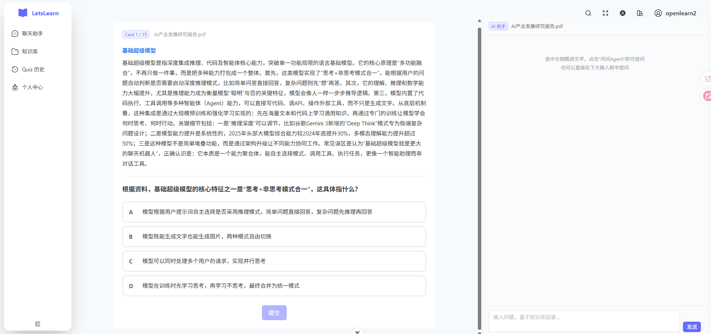
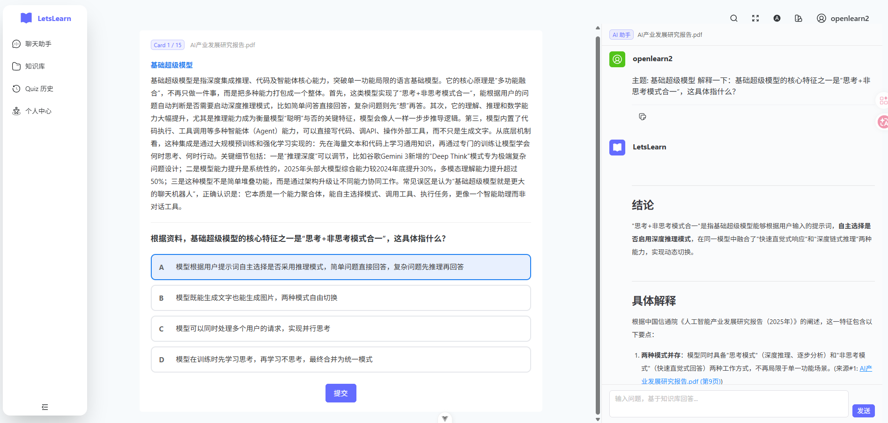
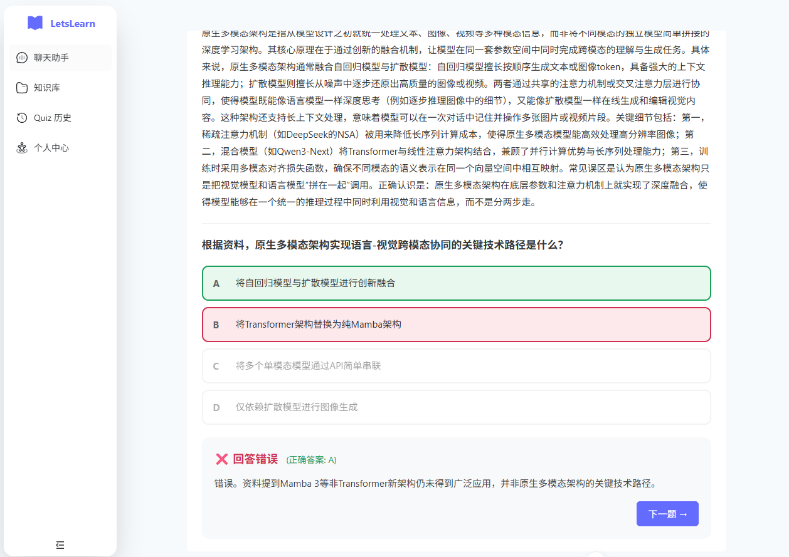
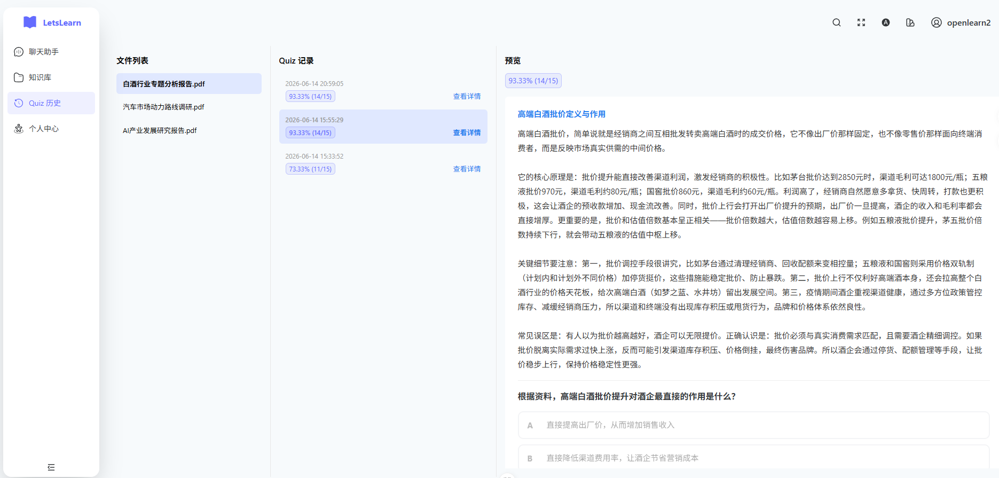
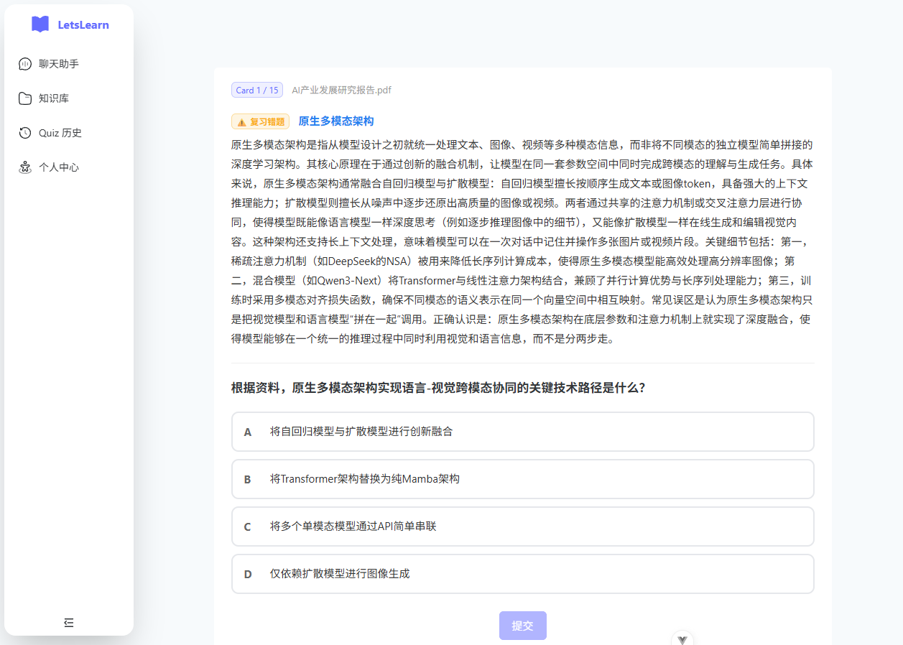

# LetsLearn

English | [中文](README_CN.md)

Enterprise AI knowledge management system + Duolingo-style AI learning agent, powered by RAG.

## LetsLearn: AI Learning Agent

- **Smart Quiz Generation**: Upload textbook PDFs → LangGraph Agent identifies key concepts → 15 parallel cards generated (~14s)
- **Interactive Learning**: AI explanation + multiple-choice + instant feedback, Duolingo-style card flipping
- **Long-Term Memory**: MySQL-backed quiz records and mistake tracking across sessions. Auto-injects mistake cards on re-quiz
- **AI Chat Sidebar**: Select-to-search — highlight any text to query the RAG Agent
- **Quiz History**: Dual-list browser with preview panel for full replay
- **Real-Time Progress**: SSE streaming with live progress bar

> **Agent Stack**: Python FastAPI + LangGraph (Send fan-out) + DeepSeek + MySQL + Elasticsearch

## Features

- Auto-generate quiz cards with AI explanations from textbook PDFs


- Stuck on a question? Ask the RAG Agent directly via the AI sidebar


- Got it wrong? AI explains the answer in detail


- Want to review past quizzes? OneNote-style history browser with preview


- Need a refresher? AI reads your mistake history and generates targeted review


## Tech Stack

**Backend**: Spring Boot 3.4 + Java 17 + MySQL + Redis + Elasticsearch + Kafka + MinIO + WebSocket + Spring Security + JWT

**Frontend**: Vue 3 + TypeScript + Vite + Naive UI + Pinia

**Python Agent**: FastAPI + LangGraph + elasticsearch-py + httpx

## Quick Start

```bash
# 1. Start infrastructure
cd docs && docker compose up -d

# 2. Configure
cp .env.example .env
# Edit .env with your DEEPSEEK_API_KEY and EMBEDDING_API_KEY

# 3. Backend
mvn spring-boot:run

# 4. Python Agent (Quiz generation)
cd learning-agent && python3 -m venv venv && source venv/bin/activate
pip install elasticsearch fastapi uvicorn langgraph langgraph-checkpoint httpx pydantic
uvicorn main:app --port 8000

# 5. Frontend
cd frontend && pnpm install && pnpm dev
```

## Key Features

- **Document Management**: Chunked upload + resume, Kafka async pipeline (LiteParse OCR + Tika), ES hybrid search (KNN + BM25)
- **AI Chat**: DeepSeek ReAct Agent, WebSocket streaming, source citations with PDF preview
- **Quiz Learning**: LangGraph Send fan-out parallel generation, SQL long-term memory, cross-session mistake review
- **Multi-Tenant**: Organization tags + permission filtering, user data isolation
